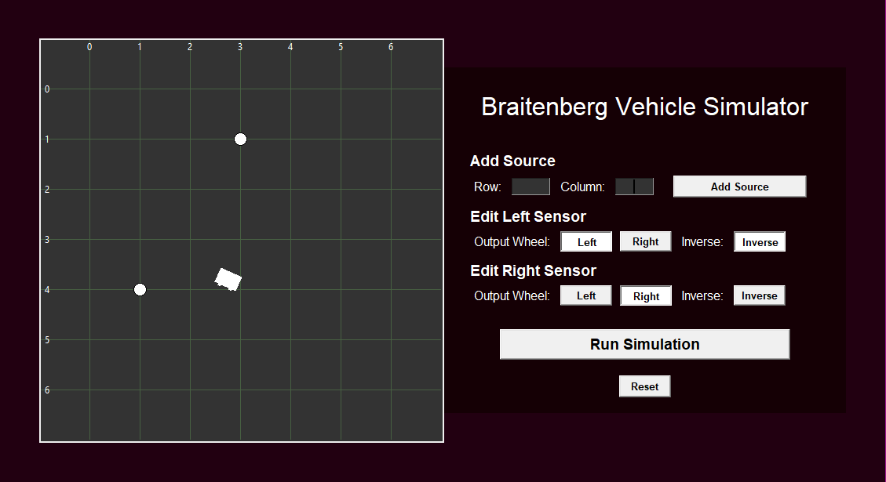

# Braitenberg Vehicle Simulator

Braitenberg Vehicles are autonomous agents consisting of simple sensors and actuators. In most examples, the sensors detect light, and the actuators are wheel motors. When connected and configured in various ways, these basic hardware components can lead to the vehicle appearing to exhibit various goal oriented behaviors such as "avoiding" sources or "attacking" them.

This Python-based simulator allows for the editing of basic configurations for a Braitenberg vehicle, as well as a view of its behavior in an environment of sources.




## Setting up Development Environment

*Note: Make sure you have both Python 3 and virtualenv installed on your machine*

1. Open a command window within the project directory and run the command ```new_env```. This will create a new virtual environment and install all the necessary Python packages.
2. Run the command ```Scripts\activate.bat```. This will activate the virtual environment so any changes in Python packages will only be made locally for the project.
3. Run ```python main.py``` in order to launch the simulator interface.
4. When finished wtih any edits, run ```deactivate``` to close the virtual environment.


## Generating Executable File

The simulator can be packaged into a standalone Windows executable file. To do this run the command:

```pyinstaller --noconsole --onefile --name braitenberg --add-data favicon.ico;. --icon="favicon.ico" main.py```
